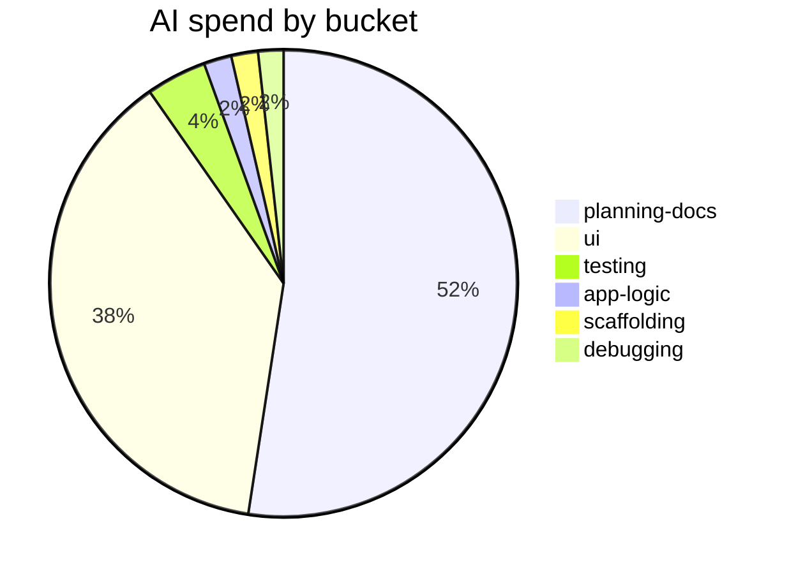

# AI Usage

Token and cost breakdown for the FretFlow build, attributed to six coarse buckets.
Generated from session transcripts + a mark sidecar (`ai-usage.marks.jsonl`).

## By bucket

| Bucket | Messages | All-in $ | Share |
|---|--:|--:|--:|
| planning-docs | 697 | $41.88 | 52% |
| ui | 591 | $30.26 | 38% |
| testing | 59 | $3.34 | 4% |
| app-logic | 66 | $1.53 | 2% |
| scaffolding | 81 | $1.48 | 2% |
| debugging | 36 | $1.40 | 2% |
| **Total** | **1,530** | **$79.91** | |

## Work vs. context

| | $ |
|---|--:|
| Work (fresh input + output) | $28.53 |
| Context (cache reads/writes) | $51.38 |
| **All-in** | **$79.91** |

Cache carries ~64% of the bill. Generating tokens was cheap; carrying a growing
context window session after session is where the cost lives.

## What the numbers say

Planning and docs consumed the most tokens by a wide margin (52%), mostly because
every session starts by reloading the full design notes, journal, and codebase state
into context. The UI bucket (38%) reflects that the visual design went through several
full rewrites. The theory core (app-logic + testing combined, ~6%) is small because
TDD kept each step tight and well-scoped.
