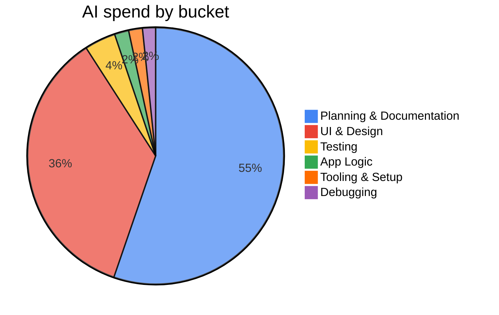
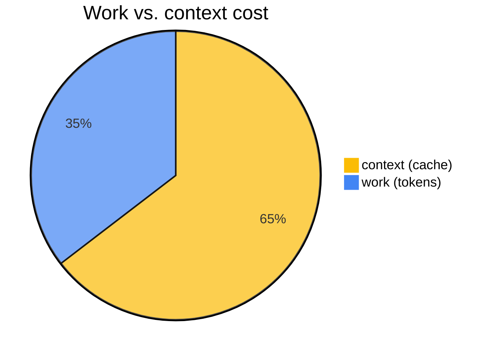

# AI Usage

Token and cost breakdown for the FretFlow build, attributed to six coarse buckets.

> **Note on costs:** figures below are calculated at Claude API pay-per-token rates
> for transparency and reproducibility. In practice this project was built on a flat
> Claude Pro subscription — clearly worth it.

---

## Tokens Used By Bucket

| Bucket                   |  Messages |   All-in $ | Share |
| ------------------------ | --------: | ---------: | ----: |
| Planning & Documentation |       857 |     $47.00 |   55% |
| UI & Design              |       591 |     $30.26 |   36% |
| Testing                  |        59 |      $3.34 |    4% |
| App Logic                |        66 |      $1.53 |    2% |
| Tooling & Setup          |        81 |      $1.48 |    2% |
| Debugging                |        36 |      $1.40 |    2% |
| **Total**                | **1,690** | **$85.01** |       |



## Work vs. Context

|                              |          $ | Share |
| ---------------------------- | ---------: | ----: |
| Context (cache reads/writes) |     $54.90 |   65% |
| Work (fresh input + output)  |     $30.11 |   35% |
| **All-in**                   | **$85.01** |       |



Generating tokens was cheap; carrying a growing context window session after session
is where the cost lives. Cache reads are billed at ~0.1x the input rate — so even
though cache dominates the bill, it's already heavily discounted compared to fresh input.

## What the numbers say

Planning and docs consumed the most tokens by a wide margin (55%), mostly because
every session starts by reloading the full design notes, journal, and codebase state
into context. The UI bucket (36%) reflects that the visual design went through several
full rewrites. The theory core (app-logic + testing combined, ~6%) is small because
TDD kept each step tight and well-scoped.

## How tracking works

Every Claude Code session produces a JSONL transcript under
`~/.claude/projects/<repo-path>/`. Each message in the transcript carries exact
`usage` fields (input tokens, output tokens, cache read tokens, cache write tokens)
and the model ID, so costs can be computed precisely after the fact — no estimates.

To attribute that usage to meaningful categories, a lightweight "mark sidecar" was
set up alongside the transcripts:

**`docs/ai-usage.marks.jsonl`** — an append-only file of timestamped bucket marks:

```json
{
  "ts": "2026-06-12T23:00:00Z",
  "bucket": "ui",
  "note": "FretboardDiagram SVG component"
}
```

A message belongs to whichever bucket was active at its timestamp (the most recent
mark at-or-before that message). Switching focus drops a new mark; the file is plain
text so boundaries can be hand-corrected at any time.

**`mark.py`** — a tiny script that appends a mark with an auto-stamped UTC timestamp
and validates the bucket against the six-value enum. Claude Code can call it via Bash;
Karl can call it from the terminal. Either way the timestamp aligns with the transcript.

**`usage_report.py`** — reads the transcripts, deduplicates messages by UUID (Claude
Code sometimes retries), joins with the marks file, prices each message per model
at published API rates, and prints a markdown table broken down by bucket and model.

**`/clean-up` skill** — a custom Claude Code slash command that runs at the end of
each session. Step 0 reconstructs the session's bucket boundaries from hindsight
(the reliable moment to set them, rather than remembering to drop marks mid-flow),
then journals what was done and hands off a fresh context prompt. The skill is what
makes the whole system low-friction enough to actually use.
